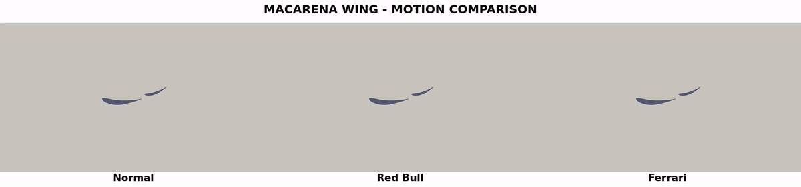
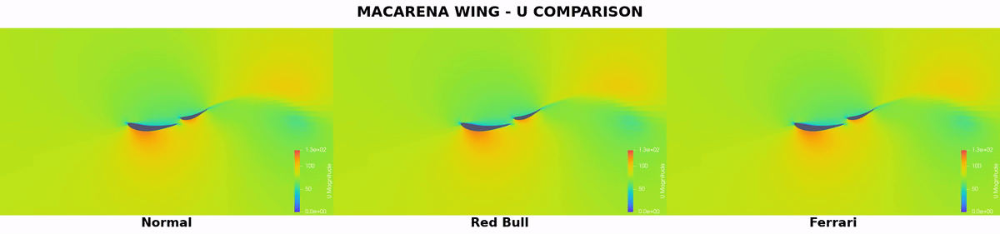
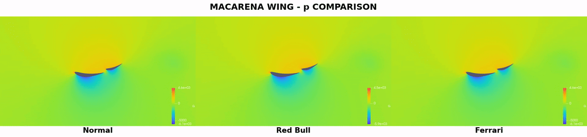
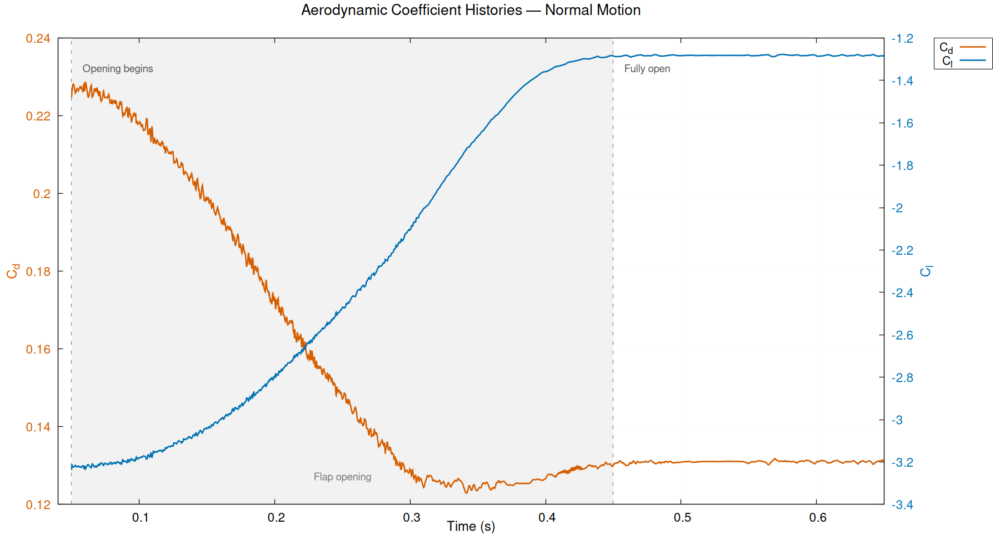
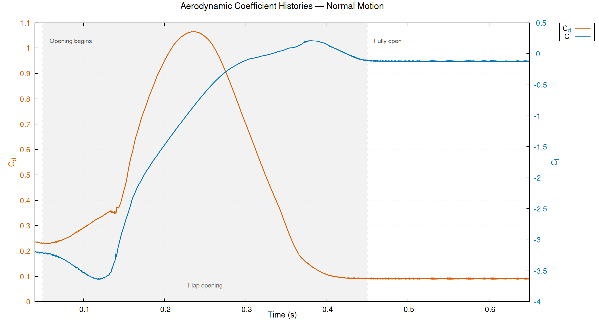
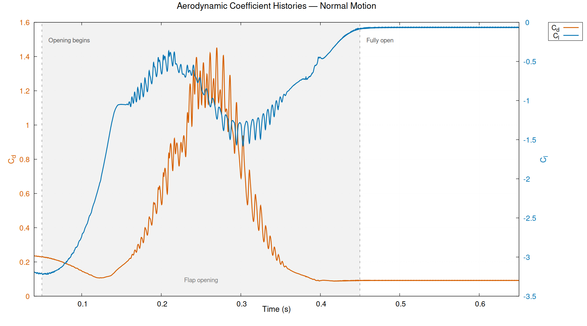

# Dynamic Aerodynamic Analysis of Active Rear-Wing Motions

OpenFOAM case setups, processed aerodynamic data, and flow visualizations for a computational study comparing three prescribed rear-wing flap motions using a common E423-based wing-section geometry.

The three motion strategies investigated are:

- **Conventional DRS-inspired motion** — prescribed flap rotation of **−20°**
- **Red Bull-inspired motion** — prescribed flap rotation of **+160°**
- **Ferrari-inspired motion** — prescribed flap rotation of **−200°**

The objective of this repository is to document the numerical setup and processed results used to compare the transient aerodynamic response of these three motion strategies under otherwise identical simulation conditions.

> **Naming clarification:** The terms **Conventional DRS-inspired**, **Red Bull-inspired**, and **Ferrari-inspired** are research labels describing the qualitative motion concepts examined in this study. “Inspired” does **not** mean that the simulations reproduce an official or proprietary Formula 1 geometry, actuator system, control law, or measured team kinematics. The prescribed rotation angles and motion profiles are simplified numerical inputs selected for comparative CFD analysis. No affiliation or endorsement is implied.

---

## Research Overview

This study investigates how different prescribed flap-rotation strategies affect the transient aerodynamic behavior of an active rear-wing section.

All three production cases use the same:

- E423-based main-wing and flap geometry
- computational domain
- circular non-conformal mesh interface
- mesh-generation procedure
- boundary conditions
- turbulence model
- numerical schemes
- solver controls
- aerodynamic force definitions
- freestream conditions
- simulation duration

The principal controlled variable is the prescribed flap-motion profile contained in:

```text
constant/dynamicMeshDict
```

The production cases are therefore designed to isolate the influence of the flap-motion strategy while keeping the remainder of the numerical configuration consistent.

Processed results are provided for:

- flap motion
- velocity magnitude
- pressure field
- drag coefficient
- lift coefficient
- moment coefficient
- synchronized visual comparison between the three motion strategies

---

## Case Matrix

| Case | Prescribed Rotation | Motion Interval | Simulation End Time |
|---|---:|---:|---:|
| Conventional DRS-inspired | −20° | 0.050–0.450 s | 0.650 s |
| Red Bull-inspired | +160° | 0.050–0.450 s | 0.650 s |
| Ferrari-inspired | −200° | 0.050–0.450 s | 0.650 s |

Each motion uses a smooth angular-velocity profile rather than an instantaneous rotation.

The general motion sequence is:

```text
0.000–0.050 s   Initial stationary period
0.050–0.450 s   Prescribed flap motion
0.450–0.650 s   Final stationary period
```

The different total rotation angles are generated through different time-dependent angular-velocity definitions while preserving the same motion interval.

---

# Modelling Assumptions and Comparison Basis

The study is designed as a controlled numerical comparison rather than a reconstruction of a complete Formula 1 rear-wing system. The principal assumptions used to define the comparison are summarized below.

## Common 400 ms Motion Interval

The **2026 FIA Formula 1 Technical Regulations**, Article **C3.11.6(d)**, specify that the rear-wing adjuster system must have a maximum transition time between its two fixed positions that **does not exceed 400 ms**. The regulation defines this interval from the command issued by the FIA Standard ECU until the rear-wing position sensor confirms that the commanded position has been reached.

For this study, that **400 ms upper limit is adopted as a common timing reference** for all three prescribed motions. Therefore, each flap begins moving at **0.050 s** and reaches its final prescribed orientation at **0.450 s**, giving an identical motion duration of **0.400 s**.

Using the same transition interval provides a direct comparison basis: differences in the transient aerodynamic response are not caused by one case simply being given more or less time to complete its motion. Instead, the cases differ through the prescribed rotation direction, total angular displacement, and the corresponding time-dependent angular-velocity profile.

> **Scope of this assumption:** The 400 ms value is used here as a **timing normalization inspired by the FIA transition-time limit**. It should not be interpreted as evidence that the large-angle Red Bull-inspired or Ferrari-inspired motions are themselves FIA-compliant implementations. Their rotation angles, geometry, actuation, and kinematics remain conceptual research inputs.

Official reference: [FIA 2026 Formula 1 Regulations — Section C (Technical), Issue 20](https://www.fia.com/system/files/documents/fia_2026_f1_regulations_-_section_c_technical_-_iss_20_-_2026-08-05.pdf), Article C3.11.6(d).

## Additional Modelling Assumptions

- The main wing and flap are treated as rigid aerodynamic surfaces.
- Flap motion is prescribed kinematically; actuator dynamics, structural deformation, backlash, and control-system response are not solved.
- All three cases use the same E423-based wing-section geometry, freestream condition, turbulence model, numerical setup, and overall simulation duration.
- The simulations represent an isolated wing-section comparison rather than complete-car Formula 1 aerodynamics.
- Team-inspired labels are used only to distinguish conceptual motion strategies and do not imply reproduction of proprietary hardware or data.

---

# Results

Processed results from the three completed production simulations are stored under:

```text
results/
```

The repository contains both individual-case results and synchronized three-case comparisons.

---

## Motion Comparison

The animation below compares the prescribed flap motion of all three configurations using a common visualization window and synchronized time sequence.

<p align="center">
  
</p>

**Full-resolution version:**  
[Macarena Motion Comparison — MP4](results/comparison/Macarena_Motion_Comparison.mp4)

---

## Velocity-Field Comparison

Velocity magnitude is visualized using a consistent post-processing configuration so that differences in the transient flow field can be compared directly between the three motion strategies.

<p align="center">
  
</p>

**Full-resolution version:**  
[Macarena Velocity Comparison — MP4](results/comparison/Macarena_U_Comparison.mp4)

---

## Pressure-Field Comparison

The transient OpenFOAM pressure-field response is shown using the same camera framing, synchronized time sequence, and visualization procedure for all three production cases.

<p align="center">
  
</p>

**Full-resolution version:**  
[Macarena Pressure Comparison — MP4](results/comparison/Macarena_p_Comparison.mp4)

---

# Aerodynamic Coefficients

Aerodynamic force and moment coefficients are evaluated over both the `mainWing` and `flap` patches.

For each production case, the repository includes:

- combined drag and lift coefficient history
- drag coefficient history
- lift coefficient history
- moment coefficient history
- merged force-coefficient dataset

The published merged coefficient datasets extend through the complete simulation interval to **0.65 s**.

---

## Conventional DRS-inspired Motion

<p align="center">
  
</p>

Additional results:

- [Drag coefficient history](results/normal/coefficients/Macarena_Normal_Cd.png)
- [Lift coefficient history](results/normal/coefficients/Macarena_Normal_Cl.png)
- [Moment coefficient history](results/normal/coefficients/Macarena_Normal_Cm.png)
- [Merged force-coefficient dataset](results/normal/coefficients/forceCoeffs_Normal.dat)

---

## Red Bull-inspired Motion

<p align="center">
  
</p>

Additional results:

- [Drag coefficient history](results/redbull/coefficients/Macarena_RedBull_Cd.png)
- [Lift coefficient history](results/redbull/coefficients/Macarena_RedBull_Cl.png)
- [Moment coefficient history](results/redbull/coefficients/Macarena_RedBull_Cm.png)
- [Merged force-coefficient dataset](results/redbull/coefficients/forceCoeffs_RedBull.dat)

---

## Ferrari-inspired Motion

<p align="center">
  
</p>

Additional results:

- [Drag coefficient history](results/ferrari/coefficients/Macarena_Ferrari_Cd.png)
- [Lift coefficient history](results/ferrari/coefficients/Macarena_Ferrari_Cl.png)
- [Moment coefficient history](results/ferrari/coefficients/Macarena_Ferrari_Cm.png)
- [Merged force-coefficient dataset](results/ferrari/coefficients/forceCoeffs_Ferrari.dat)

---

# Individual Flow Visualizations

Individual animations are provided in both GIF and MP4 format.

GIF files are intended for immediate browser-based viewing, while MP4 files preserve the higher-resolution animation output.

---

## Conventional DRS-inspired Motion

| Quantity | GIF | MP4 |
|---|---|---|
| Motion | [View GIF](results/normal/Macarena_Normal_Motion.gif) | [View MP4](results/normal/Macarena_Normal_Motion.mp4) |
| Velocity | [View GIF](results/normal/Macarena_Normal_U.gif) | [View MP4](results/normal/Macarena_Normal_U.mp4) |
| Pressure | [View GIF](results/normal/Macarena_Normal_p.gif) | [View MP4](results/normal/Macarena_Normal_p.mp4) |

---

## Red Bull-inspired Motion

| Quantity | GIF | MP4 |
|---|---|---|
| Motion | [View GIF](results/redbull/Macarena_RedBull_Motion.gif) | [View MP4](results/redbull/Macarena_RedBull_Motion.mp4) |
| Velocity | [View GIF](results/redbull/Macarena_RedBull_U.gif) | [View MP4](results/redbull/Macarena_RedBull_U.mp4) |
| Pressure | [View GIF](results/redbull/Macarena_RedBull_p.gif) | [View MP4](results/redbull/Macarena_RedBull_p.mp4) |

---

## Ferrari-inspired Motion

| Quantity | GIF | MP4 |
|---|---|---|
| Motion | [View GIF](results/ferrari/Macarena_Ferrari_Motion.gif) | [View MP4](results/ferrari/Macarena_Ferrari_Motion.mp4) |
| Velocity | [View GIF](results/ferrari/Macarena_Ferrari_U.gif) | [View MP4](results/ferrari/Macarena_Ferrari_U.mp4) |
| Pressure | [View GIF](results/ferrari/Macarena_Ferrari_p.gif) | [View MP4](results/ferrari/Macarena_Ferrari_p.mp4) |

---

# Numerical Setup

## Solver

- **OpenFOAM Foundation v13**
- Solver: `incompressibleFluid`
- transient incompressible simulation

---

## Flow Conditions

- Freestream velocity: **80 m/s**
- Kinematic viscosity: **1.486 × 10⁻⁵ m²/s**
- Reference density for aerodynamic coefficients: **1.225 kg/m³**

---

## Turbulence Modelling

The production simulations use a Reynolds-averaged turbulence formulation:

- **RANS**
- **k-ω SST**

The turbulence configuration is defined in:

```text
constant/momentumTransport
```

## Near-Wall Treatment and y+

The simulations employ wall-function treatment in conjunction with the **k-ω SST** RANS turbulence model.

The average wall \(y^+\) values at the final simulation time, **t = 0.65 s**, are:

| Case | `mainWing` Average \(y^+\) | `flap` Average \(y^+\) |
|---|---:|---:|
| Conventional DRS-inspired | **43.40** | **46.99** |
| Red Bull-inspired | **46.69** | **59.25** |
| Ferrari-inspired | **58.14** | **59.82** |

The three production cases use the same mesh, freestream velocity, fluid properties, and turbulence model. The present simulations use a wall-function RANS treatment rather than a wall-resolved `y+ ≈ 1` SST formulation.

---

## Reference Quantities

Aerodynamic coefficients use:

- Reference chord, `lRef`: **0.20 m**
- Reference area, `Aref`: **0.004 m²**
- Freestream reference velocity, `magUInf`: **80 m/s**
- Reference density, `rhoInf`: **1.225 kg/m³**

Aerodynamic loads are evaluated over:

```text
mainWing
flap
```

---

# Moving-Mesh Method

The movable flap is contained within a dedicated rotating cell zone.

Motion is prescribed using OpenFOAM's solid-body motion framework:

```text
motionSolver
    ↓
solidBody
    ↓
rotatingMotion
```

with the rotation origin located at the flap hinge.

A circular non-conformal interface separates the rotating near-field region from the stationary surrounding mesh.

The angular velocity is defined as a time-dependent table in:

```text
constant/dynamicMeshDict
```

Integrating each angular-velocity profile over the prescribed motion interval produces the corresponding total flap rotation.

The moving-mesh architecture is common to all three production cases. The prescribed motion definition is the principal quantity varied between them.

---

# Repository Structure

```text
.
├── README.md
│
├── cases/
│   ├── Normal_DRS/
│   │   ├── 0/
│   │   ├── constant/
│   │   │   └── triSurface/
│   │   └── system/
│   │
│   ├── RedBull_160deg/
│   │   ├── 0/
│   │   ├── constant/
│   │   │   └── triSurface/
│   │   └── system/
│   │
│   └── Ferrari_200deg/
│       ├── 0/
│       ├── constant/
│       │   └── triSurface/
│       └── system/
│
├── scripts/
│   └── postProcessing/
│       └── plot_force_coefficients.gnuplot
│
└── results/
    ├── comparison/
    │   ├── Macarena_Motion_Comparison.gif
    │   ├── Macarena_Motion_Comparison.mp4
    │   ├── Macarena_U_Comparison.gif
    │   ├── Macarena_U_Comparison.mp4
    │   ├── Macarena_p_Comparison.gif
    │   └── Macarena_p_Comparison.mp4
    │
    ├── normal/
    │   ├── Macarena_Normal_Motion.gif
    │   ├── Macarena_Normal_Motion.mp4
    │   ├── Macarena_Normal_U.gif
    │   ├── Macarena_Normal_U.mp4
    │   ├── Macarena_Normal_p.gif
    │   ├── Macarena_Normal_p.mp4
    │   └── coefficients/
    │       ├── Macarena_Normal_Cd.png
    │       ├── Macarena_Normal_Cd_Cl.png
    │       ├── Macarena_Normal_Cl.png
    │       ├── Macarena_Normal_Cm.png
    │       └── forceCoeffs_Normal.dat
    │
    ├── redbull/
    │   ├── Macarena_RedBull_Motion.gif
    │   ├── Macarena_RedBull_Motion.mp4
    │   ├── Macarena_RedBull_U.gif
    │   ├── Macarena_RedBull_U.mp4
    │   ├── Macarena_RedBull_p.gif
    │   ├── Macarena_RedBull_p.mp4
    │   └── coefficients/
    │       ├── Macarena_RedBull_Cd.png
    │       ├── Macarena_RedBull_Cd_Cl.png
    │       ├── Macarena_RedBull_Cl.png
    │       ├── Macarena_RedBull_Cm.png
    │       └── forceCoeffs_RedBull.dat
    │
    └── ferrari/
        ├── Macarena_Ferrari_Motion.gif
        ├── Macarena_Ferrari_Motion.mp4
        ├── Macarena_Ferrari_U.gif
        ├── Macarena_Ferrari_U.mp4
        ├── Macarena_Ferrari_p.gif
        ├── Macarena_Ferrari_p.mp4
        └── coefficients/
            ├── Macarena_Ferrari_Cd.png
            ├── Macarena_Ferrari_Cd_Cl.png
            ├── Macarena_Ferrari_Cl.png
            ├── Macarena_Ferrari_Cm.png
            └── forceCoeffs_Ferrari.dat
```

---

# Case Contents

Each production case contains the standard OpenFOAM configuration directories required to reconstruct the numerical setup.

## `0/`

Initial and boundary-condition fields:

- `U`
- `p`
- `k`
- `omega`
- `nut`

---

## `constant/`

Physical properties, turbulence configuration, geometry, and moving-mesh definitions:

- `physicalProperties`
- `momentumTransport`
- `dynamicMeshDict`
- `triSurface/mainWing.stl`
- `triSurface/flap.stl`

---

## `system/`

Mesh generation, solver control, numerical schemes, parallel decomposition, and post-processing definitions:

- `blockMeshDict`
- `snappyHexMeshDict`
- `createBafflesDict`
- `meshQualityDict`
- `controlDict`
- `fvSchemes`
- `fvSolution`
- `decomposeParDict`
- `functions`

---

# Post-Processing

Flow visualization was performed using ParaView / ParaFoam.

For the synchronized comparison animations, all three production cases were post-processed using consistent:

- camera position
- field representation
- image framing
- time synchronization
- animation duration

Consistent visualization settings allow the motion, velocity, and pressure fields to be compared directly between the three cases.

---

## Aerodynamic Coefficient Processing

OpenFOAM writes aerodynamic coefficient data into segmented `forceCoeffs.dat` output directories during the simulation.

These segments were merged into continuous time histories before plotting.

The common Gnuplot script used to generate the aerodynamic coefficient figures is included at:

```text
scripts/postProcessing/plot_force_coefficients.gnuplot
```

The script supports:

- drag coefficient, `Cd`
- lift coefficient, `Cl`
- moment coefficient, `Cm`
- combined `Cd` and `Cl` dual-axis plots
- automatic merging of segmented OpenFOAM `forceCoeffs.dat` output
- plotting directly from the merged datasets published in this repository

The published coefficient datasets are located at:

```text
results/normal/coefficients/forceCoeffs_Normal.dat
results/redbull/coefficients/forceCoeffs_RedBull.dat
results/ferrari/coefficients/forceCoeffs_Ferrari.dat
```

---

## Media Processing

Processed visualization files are provided in both GIF and MP4 format.

GIF files are intended for immediate browser-based viewing through GitHub, while MP4 files preserve higher-resolution versions of the corresponding animations.

FFmpeg was used for GIF generation and synchronized comparison-video processing.

---

# Reproducibility

The three production case directories are constructed so that the numerical setup is identical except for the prescribed motion profile.

Generated mesh files are not stored in the repository.

Instead, the repository provides the:

- mesh-generation dictionaries
- surface geometry
- boundary conditions
- physical properties
- turbulence configuration
- numerical settings
- aerodynamic force definitions
- moving-mesh definitions

required to reconstruct the numerical cases.

An automated `Allrun` script is **not currently included**.

The complete mesh-generation and execution sequence has not yet been consolidated into a single end-to-end automation script that has been independently re-tested from a clean case directory.

Rather than provide an `Allrun` workflow whose complete clean-case reproducibility has not been verified, this repository preserves the underlying OpenFOAM configuration files directly.

The aerodynamic coefficient post-processing workflow is separately reproducible using:

```text
scripts/postProcessing/plot_force_coefficients.gnuplot
```

The published `results/` directory contains selected processed outputs derived from the completed production simulations, including:

- aerodynamic coefficient histories
- merged force-coefficient datasets
- processed PNG figures
- GIF animations
- MP4 visualizations
- synchronized three-case comparisons

---

# What Is Not Included

Large generated solver output and intermediate working files are intentionally excluded from the repository.

This includes:

- `processor*/`
- reconstructed transient time directories
- `constant/polyMesh/`
- raw transient field data
- complete raw OpenFOAM `postProcessing/` directories
- intermediate ParaView state files
- intermediate animation frame sequences
- temporary validation cases
- development backups
- incomplete or superseded production runs

Selected processed results are instead included separately under:

```text
results/
```

These processed outputs preserve the principal aerodynamic and visualization results without turning the repository into an archive of the complete transient CFD field solution.

---

# Development and OpenFOAM Tutorial Lineage

The case development began from standard workflows and examples provided with **OpenFOAM Foundation v13**.

In particular, the solid-body rotating-mesh framework used in:

```text
constant/dynamicMeshDict
```

was adapted from the official OpenFOAM `mixerVessel2D` tutorial and subsequently modified for:

- the E423-based wing geometry
- the project-specific flap hinge location
- the circular non-conformal interface
- prescribed time-dependent angular velocity
- conventional and large-angle flap rotations
- aerodynamic coefficient evaluation
- the numerical and mesh requirements of the present study

The official `wingMotion` tutorial family was also used as a reference during the development and evaluation of moving-mesh approaches.

---

# Research Status

The three production cases documented in this repository completed the prescribed transient simulation sequence through **0.65 s**.

The published aerodynamic coefficient datasets also extend through **0.65 s**.

Processed results are provided under `results/`, including:

- flap-motion animations
- velocity-field animations
- pressure-field animations
- aerodynamic coefficient histories
- merged force-coefficient datasets
- synchronized visual comparisons between the three motion strategies

The complete transient OpenFOAM field data are not included because of their substantially larger storage requirements.

The repository instead preserves:

1. the numerical case definitions required to document and reconstruct the simulation setup; and
2. a compact set of processed numerical and visual results used to compare the three motion strategies.

---

# Interpretation of Results

The three cases are intended as a controlled numerical comparison of prescribed flap-motion strategies.

Differences observed between the simulations should therefore be interpreted within the modelling assumptions used in this study, including:

- wing-section representation
- prescribed flap kinematics
- RANS turbulence modelling
- incompressible flow formulation
- finite computational domain
- finite spatial resolution
- finite temporal resolution

The Red Bull-inspired and Ferrari-inspired cases are conceptual motion analogues used for research comparison.

They do not attempt to reproduce proprietary full-scale Formula 1 rear-wing geometry, control systems, structural behavior, or complete vehicle aerodynamics.

The results should therefore be interpreted as a comparative CFD investigation of different prescribed motion strategies rather than as a reconstruction or performance claim for any proprietary Formula 1 aerodynamic system.

---

# Software

The numerical cases were developed for:

```text
OpenFOAM Foundation v13
```

Post-processing and visualization used:

- ParaView / ParaFoam
- Gnuplot
- FFmpeg
- standard Linux command-line tools

---

# License and Attribution

OpenFOAM-related case structures and adapted workflow elements remain subject to the applicable OpenFOAM licensing terms.

Project-specific case modifications, processed data, figures, animations, and documentation should be used with appropriate attribution.

Users redistributing adapted OpenFOAM-derived material should preserve the relevant OpenFOAM licensing and attribution requirements.

---

# Citation

If this repository is used as a reference for another project, report, or derivative simulation, please cite the repository and clearly distinguish the numerical configuration used here from any independently modified:

- geometry
- mesh
- motion profile
- turbulence model
- numerical scheme
- solver configuration
- boundary condition
- post-processing procedure
